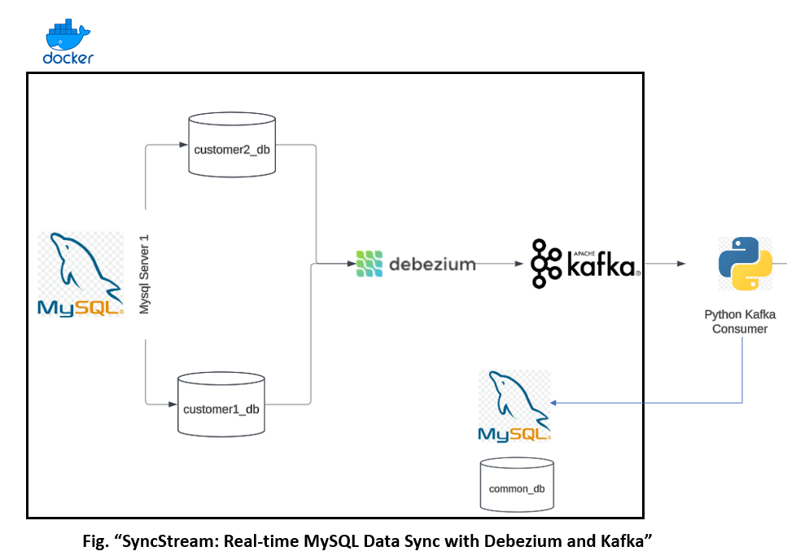

# debezium-mysql-sync

Debezium MySQL Sync Documentation

## Project Structure 🧬

## Overview
This project sets up a data synchronization pipeline using Debezium, Kafka, and MySQL. It involves two MySQL servers, Kafka for message brokering, and Debezium for change data capture (CDC). The pipeline captures changes from MySQL Server 1 and applies them to MySQL Server 2. Docker containers are used to run all the necessary services including MySQL, Kafka, Zookeeper, and Debezium Connect.

### What is Debezium?🤔
- Debezium is an open-source project that provides change data capture (CDC) for various databases. A Debezium connector is a component that monitors a specific database for changes and streams those changes to a Kafka topic. Here's a brief overview of how a Debezium connector works:

- Monitoring Changes: The connector continuously monitors the database for changes such as inserts, updates, and deletes.
- Capturing Changes: When a change occurs, the connector captures the change event, which includes details about the operation (e.g., the type of change, the affected table, and the new data).
- Streaming to Kafka: The captured change events are then streamed to a Kafka topic. Kafka acts as a message broker, allowing other systems to consume these change events in real-time.
- Applying Changes: Downstream systems, such as another database or an application, can consume the change events from the Kafka topic and apply them as needed.

## Technologies
- **Debezium**: For change data capture (CDC)
- **Kafka**: For message brokering
- **MySQL**: As the source and target databases
- **Docker**: For containerizing the services
- **Docker Compose**: For orchestrating the Docker containers
- **Zookeeper**: For managing Kafka
- **Python**: For scripting and automation
- **Kafka Python Client**: For consuming Kafka messages
- **Debezium Connect REST API**: For configuring Debezium connectors

## Prerequisites 🛠️
- Docker and Docker Compose installed
- Python 3.12 installed
- Virtual environment setup

## Setup Instructions

### Step 1: Start Docker Containers
Start the Docker containers for MySQL, Kafka, Zookeeper, and Debezium Connect using Docker Compose.

### Step 2: Initialize MySQL Databases
Run the `init_structure.py` script to create and populate the databases on MySQL Server 1 and create the database on MySQL Server 2.

### Step 3: Configure Debezium Connector
Run the `debezium_connector.py` script to configure the Debezium connector for capturing changes from MySQL Server 1.

### Step 4: Start Kafka Consumer
Run the `kafka_consumer.py` script to start the Kafka consumer, which will listen for changes and apply them to MySQL Server 2.

## Detailed Steps 💻

### 1. Start Docker Containers
The `docker-compose.yml` file defines the services required for the project, including MySQL servers, Kafka, Zookeeper, and Debezium Connect. Use the following command to start these services:

### 2. Initialize MySQL Databases
The `init_structure.py` script connects to MySQL Server 1 and creates two databases (`customer1_db` and `customer2_db`) with sample data. It also creates an empty `common_db` on MySQL Server 2.

### 3. Configure Debezium Connector
The `debezium_connector.py` script configures the Debezium connector to capture changes from the `customer1_db` and `customer2_db` databases on MySQL Server 1. It sends the configuration to the Debezium Connect REST API.

### 4. Start Kafka Consumer
The `kafka_consumer.py` script starts a Kafka consumer that listens for changes on the specified Kafka topics and applies them to the `common_db` on MySQL Server 2.

## Conclusion
By following these steps, you will set up a data synchronization pipeline that captures changes from MySQL Server 1 and applies them to MySQL Server 2 using Debezium and Kafka. This setup ensures that the data in both MySQL servers remains consistent.